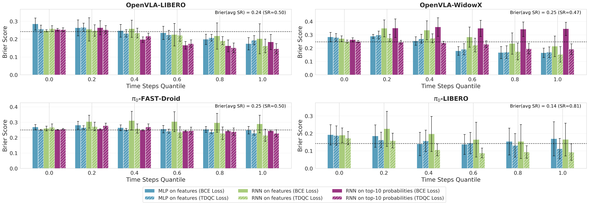

# TDQC: Temporal-Difference Quality Calibration for VLA Failure Detection

\[[Paper](#)\] \[[Website](https://shellytechnion.github.io/TDQC.github.io/)\]

This repository is the **TDQC** codebase, built on top of [SAFE](https://github.com/vla-safe/SAFE) (Multitask Failure Detection for Vision-Language-Action Models).

The repo includes training, evaluation, and plotting code for failure detectors across:

- OpenVLA (LIBERO and WidowX)
- pi0 / pi0-diff (LIBERO, SimplerEnv)
- pi0-fast (LIBERO, DROID)
- UniVLA (LIBERO)


*Figure 1: Sequential Brier score (lower is better) on an **unseen** validation set averaged over 21 random seeds (train/validation task splits). To compare calibration across rollouts with different lengths, we report Brier score over **time quantiles**. Each subplot corresponds to a (VLA model, benchmark) pair. Success prediction methods are based on sequences of features or action probabilities. Across all settings, our TD-based methods consistently outperform conventional predictors trained with binary cross entropy (BCE). For $\pi_0$ action probabilities are not directly interpretable, hence probability-based TDQC variants are not reported. The dotted horizontal line represents the Brier score of a constant predictor that consistently outputs the empirical mean success rate computed over the seen tasks.*

## Setup

```bash
# Clone
git clone https://github.com/shellytechnion/TDQC.git
cd TDQC

# Python environment
conda create -n tdqc python=3.10 -y
conda activate tdqc

# PyTorch
pip install torch torchvision torchaudio --index-url https://download.pytorch.org/whl/cu128

# Core dependencies
pip install pandas scipy pyyaml tqdm imageio[ffmpeg] hydra-core omegaconf scikit-learn \
    opencv_python einops wandb plotly matplotlib natsort flask

# Install package
pip install -e .

# Optional but recommended
wandb login
```

## Generate Rollouts from VLA Models

Please follow the repos below for adapted code that runs VLA models on simulated environments and generates rollouts for failure detection. Detailed instructions can be found in the README files of these repos.

* [openvla](https://github.com/shellytechnion/TDQC-openVLA) for OpenVLA model on the LIBERO benchmark.
* [openpi](https://github.com/vla-safe/openpi) for pi0 and pi0-FAST models on the LIBERO benchmark.
* [open-pi-zero](https://github.com/vla-safe/open-pi-zero) for pi0* models on the SimplerEnv benchmark.
* [UniVLA](https://github.com/shellytechnion/TDQC-uniVLA.git) for UniVLA model on the LIBERO benchmark.

### Download Datasets (from SAFE paper)

* **pi0-FAST on Franka:** [download link](https://drive.google.com/file/d/13z_cdwnaJota2iHkZbhYgVALujZwtM3b/view?usp=sharing)
* **OpenVLA on WidowX:** [download link](https://drive.google.com/file/d/1EwaccasZjnlM9L6SEYyWqTd7d6-BR9zp/view?usp=sharing)

After generating or downloading rollouts, set up environment variables:

```bash
cp setup_envs.bash.template setup_envs.bash
# Edit setup_envs.bash to point to your rollout directories
source setup_envs.bash
```

## Refresh Pickle Probabilities From Hidden States

Use this utility to recompute `probs` and `top10_probs` in rollout pickle files from saved hidden states via the OpenVLA `lm_head`.

```bash
# Dry-run first (no files modified)
python scripts/update_pickle_probs_from_hidden_states.py \
  --rollout_dir <path-to-rollouts> \
  --model_path <path-to-openvla-7b> \
  --dry_run --verify

# Real update
python scripts/update_pickle_probs_from_hidden_states.py \
  --rollout_dir <path-to-rollouts> \
  --model_path <path-to-openvla-7b> \
  --verify
```

## Run Experiments

This codebase supports **two main applications** of the calibrated failure detector:

1. **Early stopping with conformal prediction** — the failure detector is trained offline and used at inference time to trigger early stopping when the predicted failure probability exceeds a conformal threshold. All batch training scripts under `scripts/batch_training/` are for this application.

   

2. **Guided action search** — the failure detector (Q-network) is used online to score and select actions at each timestep, replacing the default diffusion policy action with a higher-Q candidate. The entry point is `openvla/experiments/robot/libero/run_libero_eval_with_qnetwork.py`, with launcher scripts under `scripts/run_action_search/`.

   

### Early Stopping: Batch Training Scripts

All experiment launchers are under `scripts/batch_training/`.

### OpenVLA

```bash
# OpenVLA LIBERO (SAFE/LSTM/MLP baselines and variants)
bash scripts/batch_training/submit_openvla_libero.bash

# OpenVLA LIBERO TDQC (Q-learning / top-k probabilities, BCE + TD)
bash scripts/batch_training/submit_openvla_libero_qlearning.bash

# OpenVLA WidowX (SAFE/LSTM/MLP baselines and variants)
bash scripts/batch_training/submit_openvla_widowx.bash

# OpenVLA WidowX TDQC (Q-learning / top-k probabilities)
bash scripts/batch_training/submit_openvla_widowx_qlearning.bash
```

### UniVLA

```bash
# UniVLA LIBERO (MLP/LSTM, hidden-state and top-k-prob variants, plus handcrafted)
bash scripts/batch_training/submit_univla_libero.bash
```

### pi0 / pi0-diff

```bash
# pi0-diff LIBERO (LSTM/MLP TD and BCE variants, plus sweeps)
bash scripts/batch_training/submit_pi0diff_libero.bash

# open-pi-zero on SimplerEnv
bash scripts/batch_training/submit_opi0_simpler.bash
```

### pi0-fast

```bash
# pi0-fast LIBERO (LSTM/MLP, top-k probs BCE/TD, sweeps)
bash scripts/batch_training/submit_pi0fast_libero.bash

# pi0-fast LIBERO TDQC (Q-learning experiments)
bash scripts/batch_training/submit_pi0fast_libero_qlearning.bash

# pi0-fast DROID (real-world Franka dataset)
bash scripts/batch_training/submit_pi0fast_droid.bash
```

### Guided Action Search

Run online action selection using a trained Q-network to score candidate actions at each timestep:

```bash
# Single evaluation run
python openvla/experiments/robot/libero/run_libero_eval_with_qnetwork.py

# Batch launcher scripts (grid search over thresholds and configurations)
bash scripts/run_action_search/run_grid_search.sh
bash scripts/run_action_search/run_grid_search_BCE.sh
bash scripts/run_action_search/run_grid_search_qvalue_thresh.sh
```

### Extract ROC-AUC and Calibration Results After Training

After each benchmark-specific training batch finishes, run `scripts/extract_roc_auc_results.py` to export the ROC-AUC CSVs and calibration tables used by the plotting scripts:

```bash
python scripts/extract_roc_auc_results.py \
  --benchmark <libero|widowx|droid|libero_pi0|libero_fast_pi0|univla> \
  --plot-dir ./plots_<benchmark> \
  --output ./results_<benchmark>.csv
```

### Notes on Batch Scripts

Most launcher files include multiple experiment blocks, and many are intentionally commented out.

- Uncomment the blocks you want to execute.
- Keep `--multirun` blocks as-is if you want sweep behavior.
- Adjust `train.seed`, learning rates, and model hyperparameters per your run budget.

## Aggregate and Plot Results

### SAFE plotting scripts

- `scripts/visualize_features.py` — Feature-space visualizations (Paper Figure 1, 7)
- `scripts/eval_conformal_figure.py` — Conformal prediction figure generation (Paper Figure 8)

### TDQC plotting scripts

- `scripts/plot_all_metrics.py` — Aggregate dashboard-style plotting over multiple metrics/runs
- `scripts/plot_brier_at_stop_vs_roc.py` — Trade-off analysis between Brier score at stop and ROC/AUROC
- `scripts/plot_ece_vs_brier_correlation.py` — Correlation analysis between ECE and Brier score
- `scripts/plot_tdqc_variants.py` — Side-by-side comparison of TDQC variant settings
- `scripts/plot_unified_brier.py` — Unified Brier-score plotting across models/benchmarks
- `scripts/plot_guided_action_selection_results.py` — Guided action-selection results
- `scripts/plot_quantile_roc.py` — ROC behavior across quantile-based operating points
- `scripts/plot_cp_alpha_tpr_fpr.py` — Conformal prediction TPR/FPR vs alpha curves

### Typical Workflow

1. Run training/evaluation jobs and sync metrics to W&B.
2. Export/aggregate metrics into local CSVs via `scripts/extract_roc_auc_results.py`.
3. Run the relevant plotting script(s) for the figure you want.

```bash
# Unified Brier/ECE plots (all benchmarks)
python scripts/plot_all_metrics.py
python scripts/plot_all_metrics.py --include-pi0-fast

# Correlation plots
python scripts/plot_brier_at_stop_vs_roc.py
python scripts/plot_ece_vs_brier_correlation.py

# TDQC variant comparison (writes CSV + plots)
python scripts/plot_tdqc_variants.py \
  --output-dir ./plots_tdqc_variants \
  --csv-output ./tdqc_variants_results.csv

# Quantile ROC
python scripts/plot_quantile_roc.py --benchmark <droid|widowx|libero|libero_pi0>

# Guided action-selection analysis
python scripts/plot_guided_action_selection_results.py \
  --data-root <path-to-rollouts> \
  --out-dir ./plots_beam_search_expr
```

## Save Videos

To save videos of a specific run add:

```
train.eval_save_video_functional=True train.eval_save_ckpt=True train.logs_save_path=<save path> train.seed=<desired seed, we used 0>
```

We used `seed=0` for the videos.

## Related Repositories

- [SAFE](https://github.com/vla-safe/SAFE) — Multitask Failure Detection for VLA Models (original project this codebase extends)
- [OpenVLA](https://github.com/openvla/openvla)
- [OpenPI](https://github.com/Physical-Intelligence/openpi)
- [open-pi-zero](https://github.com/allenzren/open-pi-zero)
- [UniVLA](https://github.com/baaivision/UniVLA.git)

## Citation

If you use this repository, please cite both TDQC and SAFE:

```bibtex

```
